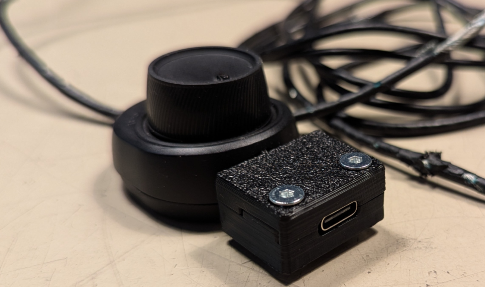

# Arctis 5 USB Housing

This repository contains a 3D model for a housing for the [Penglin USB-C Breakout board](https://www.amazon.de/dp/B0DPF59D7X?th=1).

The following files are provided as-is. No guarantee is provided that they are suited to a particular task or that they will work in all circumstances.

These design files are distributed under the [Creative Commons BY 4.0 SA license](https://creativecommons.org/licenses/by-sa/4.0/). 

For your convenience, the top and bottom halves of the housing have been exported as separate STL files. The Fusion 360 design file is included as well, last opened with Fusion 2704.1.53.